## (PROJECT-1) WEB STACK IMPLEMENTATION (LAMP STACK) IN AWS

In this project we covered the following topics:
- [x]   setting up an AWS EC2 instance.
- [x]   installing apache and updating the firewall.
- [x]   installing mysql.
- [x]   installing php.
- [x]   creating a virtual host for your website using apache.
- [x]   enable php on the website.

### SETTING UP AN AWS EC2 INSTANCE
After creating an aws account, you can create an EC2 instance 
- Connect to the EC2 instance on your local machine using.

    ```
    ssh -i "your_key_name.pem" ec2-user@your_instance_ip
    ```
    Results:
    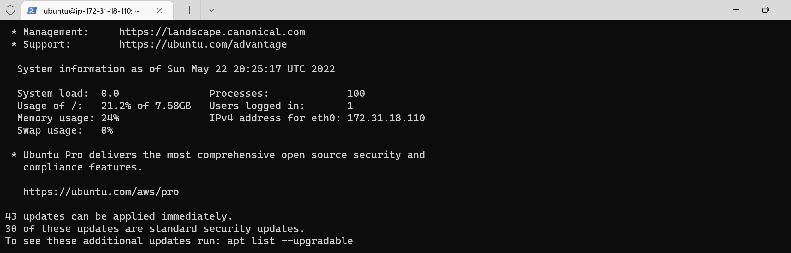
- running updates on the instance using the following command:

    ```
    sudo apt update
    ```
    Results:
    

### INSTALLING APACHE AND UPDATING THE FIREWALL
Apache is an opensource software that runs on a server. It is used to serve web pages.
In this step, we will install apache and update the firewall on our EC2 instance we have connected to remotely.

- Install apache using the following command:

    ```
    sudo apt install apache2
    ```
    Results:
    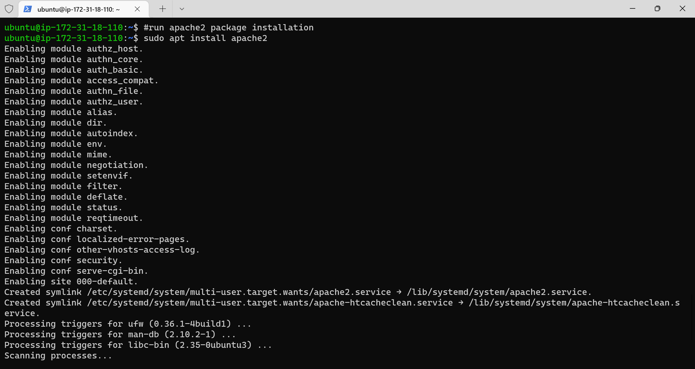

- connect to apache2 to verify that its running as a service on our instance.

    ```
    sudo systemctl status apache2
    ```
    Results:
    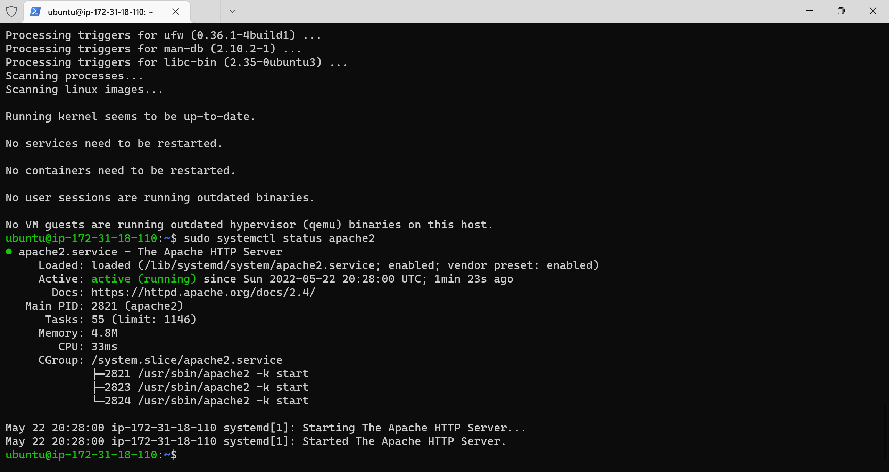
    
    After running the command and you see the output change to green and running it means it was successful.

- In order to receive any traffic from our Web Server, we need to open TCP port 80 which is the default port that web browsers use to access web pages on the Internet. 
And by default we have port 22 open on our EC2 instance. To access it via SSH, so we need to add a rule to EC2 configuration to open inbound connection through port 80.

- To test the connection and access it locally through our ubuntu machine, we will use the following command:

    ```
    curl http://localhost
    ```
    Results:
    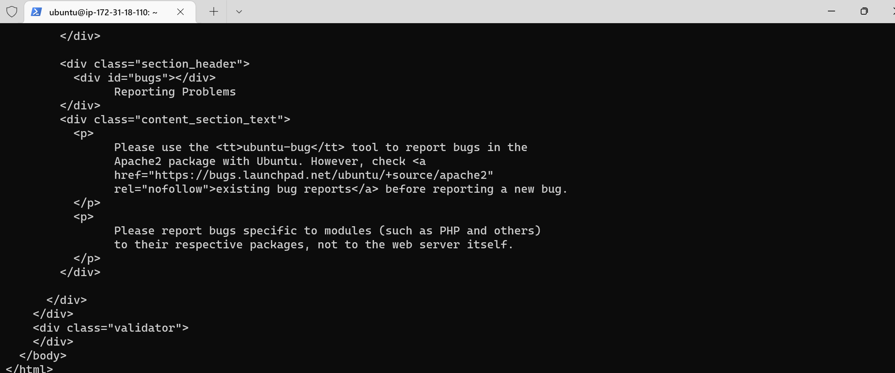

- To retrieve the Public IP address, other than to check it in AWS Web console, is to use following command:
    
    ```
    curl -s http://169.254.169.254/latest/meta-data/public-ipv4

    ```
    Results:
    

- we can then open a web browser and navigate to the public ip address of our EC2 instance.
    ```
    http://<your_public_ip_address>:80

    ```
    Results:
    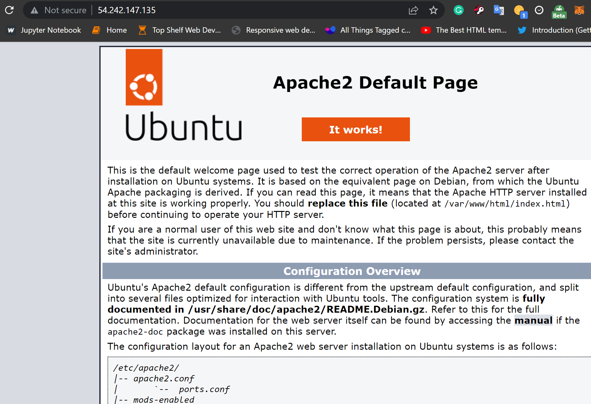


### INSTALLING MYSQL
MySQL is a database management system. It is used to store and retrieve data.

- we would need to install mysql using this command
    
    ```
    sudo apt install mysql-server
    ```
    Results:
    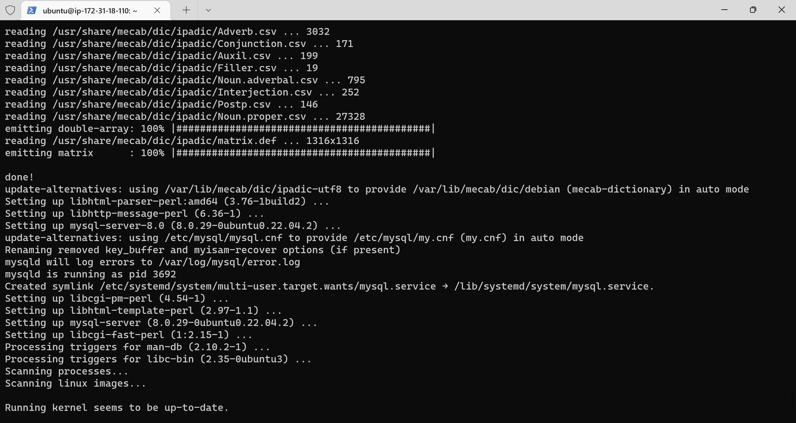
    Note: you would be required to confirm the installation type "y" and click enter key.

- login to mysql to service on our instance.

    ```
    sudo mysql
    ```
    This will connect to the MySQL server as the administrative database user root, which is inferred by the use of sudo when running this command. You should see output like this.

    Results:
    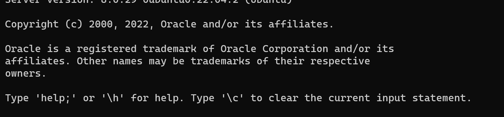

- start the interactive script by running:
    
    ```
    sudo mysql_secure_installation
    ```
    This will ask if you want to configure the VALIDATE PASSWORD PLUGIN.
    If you choose to do so, you will be prompted to enter the root password for MySQL.


    Results:
    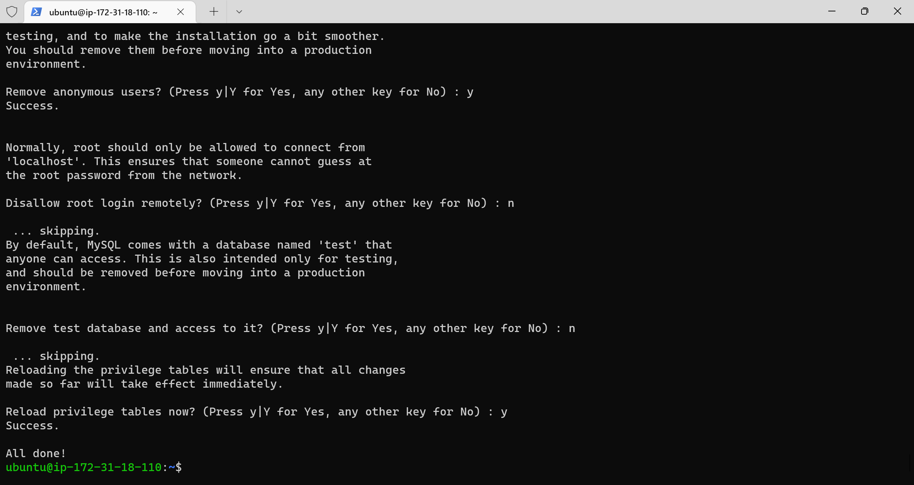

- When you’re finished, test if you’re able to log in to the MySQL console by typing:
    
    ```
    sudo mysql -p
    ```
    Results:
    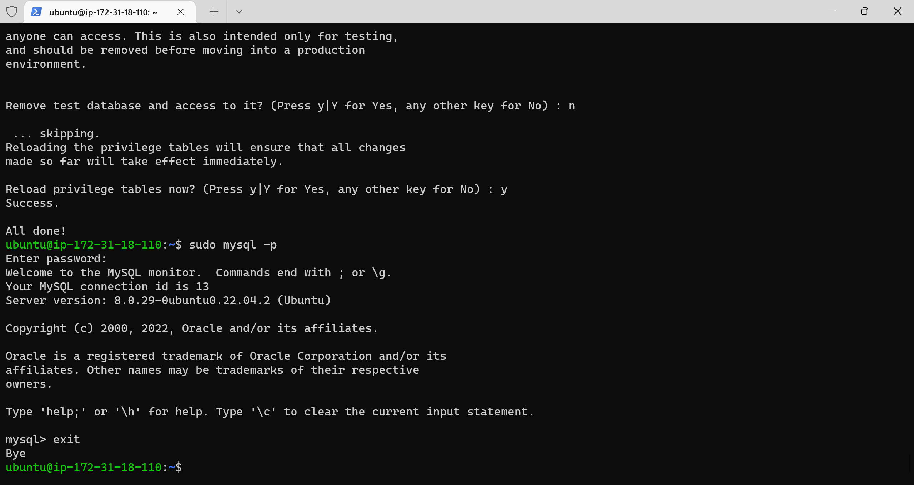
    The -p flag in this command, which will prompt you for the password used after changing the root user password.
    To exit the MySQL console.

### INSTALLING PHP
PHP is a server-side scripting language designed for web development.

- In addition to installing the php package, we need php-mysql, a PHP module that allows PHP to communicate with MySQL
    ```
    sudo apt install php libapache2-mod-php php-mysql
    ```
    Results:
    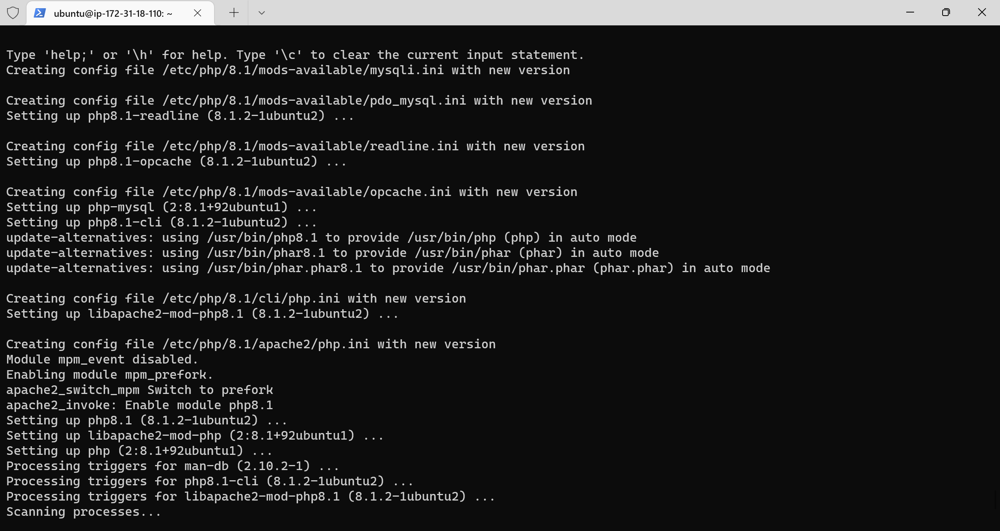
- To verify that php is installed and check the version that was installed, we can use the following command:

    ```
    php -v
    ```
    Results:
    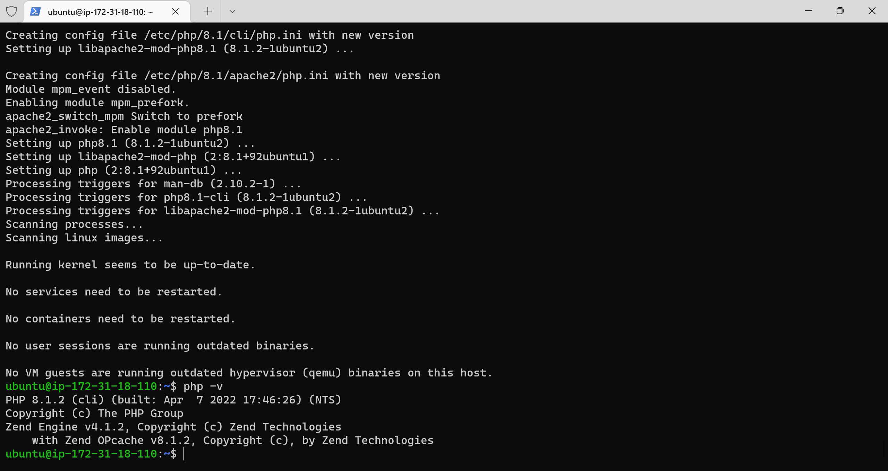

### CREATING A VIRTUAL HOST FOR YOUR WEBSITE USING APACHE
Virtual host allows you to have multiple websites located on a single machine and users of the websites will not even notice it.

As we continue with this project, we would set up a domain called projectlamp, it can be replaced this with any domain of your choice.

- Create the directory for projectlamp using ‘mkdir’ command
    
    ```
    sudo mkdir /var/www/projectlamp
    ```
    <!-- Results:
     -->

- Next, assign ownership of the directory with your current system user
    ```
    sudo chown -R $USER:$USER /var/www/projectlamp
    ```

    <!-- Results:
     -->

- We would then create and open a new configuration file in Apache’s sites-available directory using  using vi or vim
    ```
    sudo vi /etc/apache2/sites-available/projectlamp.conf
    ```
    Note: this creates a blank file. Pressing "i" on keyboard to enter insert mode. Then paste the following configuration into the file.
    ```
    <VirtualHost *:80>
        ServerName projectlamp
        ServerAlias www.projectlamp 
        ServerAdmin webmaster@localhost
        DocumentRoot /var/www/projectlamp
        ErrorLog ${APACHE_LOG_DIR}/error.log
        CustomLog ${APACHE_LOG_DIR}/access.log combined
    </VirtualHost>
    ```
    Then "ESC" and ":wq" to write and click the "ENTER/RETURN" key to save.
    
    Results:
    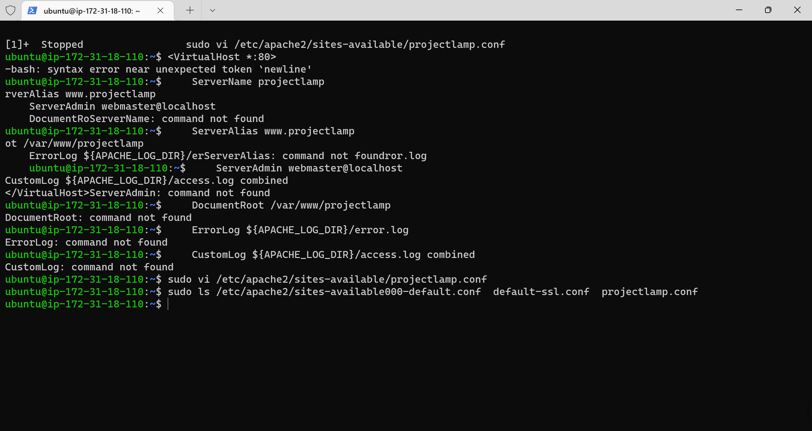

- We can use the ls command to show the new file in the sites-available directory.
    ```
    sudo ls /etc/apache2/sites-available/
    ```
    Results:
    You will see something like this:
    ```
    000-default.conf  default-ssl.conf  projectlamp.conf
    ```
    With this VirtualHost configuration, we’re telling Apache to serve projectlamp using /var/www/projectlampl as its web root directory. If you would like to test Apache without a domain name, you can remove or comment out the options ServerName and ServerAlias by adding a # character in the beginning of each option’s lines. Adding the # character there will tell the program to skip processing the instructions on those lines.

- You can now use a2ensite command to enable the new virtual host.
    ```
    sudo a2ensite projectlamp.conf
    ```
    - You can use a2dissite command to disable the new virtual host.
    ```
    sudo a2dissite 000-default
    ```
    - To make sure your configuration file doesn’t contain syntax errors, run:
    ```
    sudo apache2ctl configtest
    ```
    - If there are no errors, you can restart Apache with the following command:
    ```
    sudo systemctl restart apache2
    ```
    Results:
    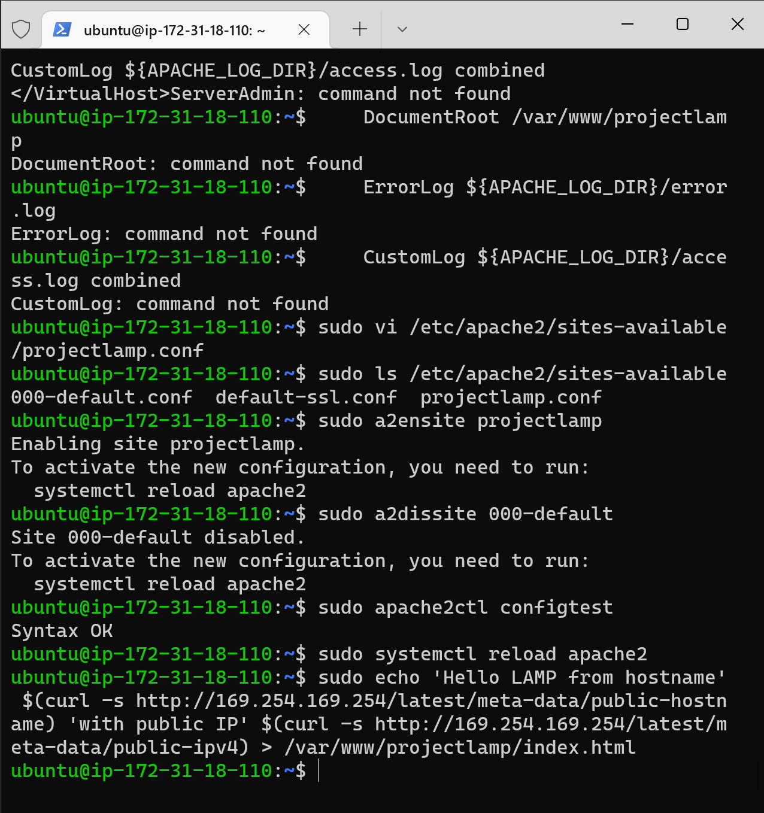

### ENABLING PHP ON THE WEBSITE
With the default DirectoryIndex settings on Apache, a file named index.html will always take precedence over an index.php file. This is useful for setting up maintenance pages in PHP applications.

In case we want to change this behavior, you’ll need to edit the /etc/apache2/mods-enabled/dir.conf file and change the order in which the index.php file is listed within the DirectoryIndex directive

- We change this behavior by editing the dir conf file:
    ```
    sudo vi /etc/apache2/mods-enabled/dir.conf
    ```
    and replacing the files content with
        ```
        <IfModule mod_dir.c>
            #Change this:
            #DirectoryIndex index.html index.cgi index.pl index.php index.xhtml index.htm
            #To this:
            DirectoryIndex index.php index.html index.cgi index.pl index.xhtml index.htm
        </IfModule>
        ```

    - After saving and closing the file, you will need to reload Apache so the changes take effect:
        ```
        sudo systemctl reload apache2
        ```
    - Finally, we will create a PHP script to test that PHP is correctly installed and configured on your server.

    Now that we have a custom location to host your website’s files and folders, we’ll create a PHP test script to confirm that Apache is able to handle and process requests for PHP files.

    - Create a new file in the /var/www/projectlamp directory called index.php
        ```
        vim /var/www/projectlamp/index.php
        ```
    - Paste the following code into the file:
        ```
        <?php
        phpinfo();
        ```
        Then we save and close the file.

    - And then refresh the webpage open on the web browser, to see something like this.
        -.png)
    - After checking the relevant information about your PHP server through that page, it’s best to remove the file you created as it contains sensitive information about your PHP environment -and your Ubuntu server. You can use rm to do so:
        ```
        sudo rm /var/www/projectlamp/index.php
        ```
    Results:
    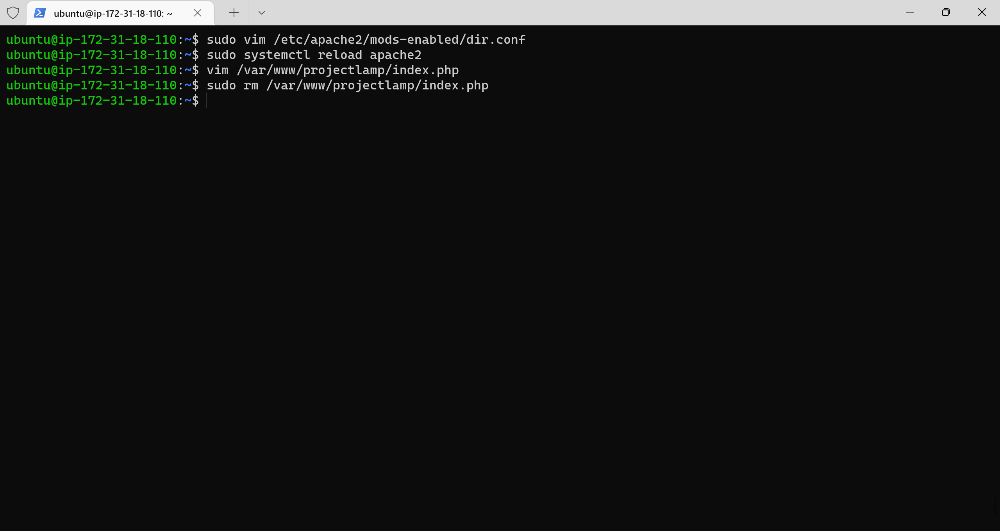