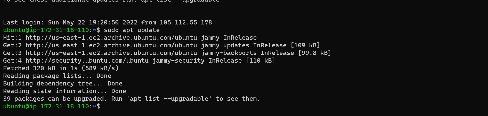
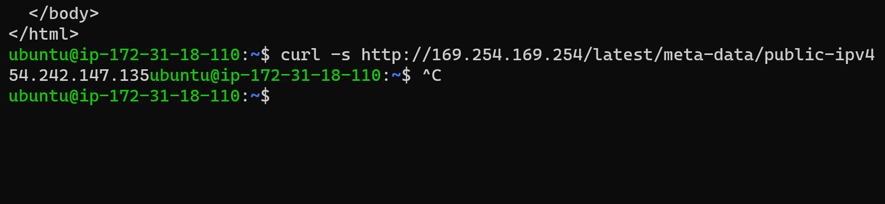

## (PROJECT-1) WEB STACK IMPLEMENTATION (LAMP STACK) IN AWS

In this project we covered the following topics:
- [x]   setting up an AWS EC2 instance.
- [x]   installing apache and updating the firewall.
- [x]   installing mysql.
- [x]   installing php.
- [x]   creating a virtual host for your website using apache.
- [x]   enable php on the website.

### SETTING UP AN AWS EC2 INSTANCE
After creating an aws account, you can create an EC2 instance 
- Connect to the EC2 instance on your local machine using.

    ```
    ssh -i "your_key_name.pem" ec2-user@your_instance_ip
    ```
    Results:
    
- running updates on the instance using the following command:

    ```
    sudo apt update
    ```
    Results:
    

### INSTALLING APACHE AND UPDATING THE FIREWALL
Apache is an opensource software that runs on a server. It is used to serve web pages.
In this step, we will install apache and update the firewall on our EC2 instance we have connected to remotely.

- Install apache using the following command:

    ```
    sudo apt install apache2
    ```
    Results:
    

- connect to apache2 to verify that its running as a service on our instance.

    ```
    sudo systemctl status apache2
    ```
    Results:
    
    
    After running the command and you see the output change to green and running it means it was successful.

- In order to receive any traffic from our Web Server, we need to open TCP port 80 which is the default port that web browsers use to access web pages on the Internet. 
And by default we have port 22 open on our EC2 instance. To access it via SSH, so we need to add a rule to EC2 configuration to open inbound connection through port 80.

- To test the connection and access it locally through our ubuntu machine, we will use the following command:

    ```
    curl http://localhost
    ```
    Results:
    

- To retrieve the Public IP address, other than to check it in AWS Web console, is to use following command:
    
    ```
    curl -s http://169.254.169.254/latest/meta-data/public-ipv4

    ```
    Results:
    

- we can then open a web browser and navigate to the public ip address of our EC2 instance.
    ```
    http://<your_public_ip_address>:80

    ```
    Results:
    


### INSTALLING MYSQL
MySQL is a database management system. It is used to store and retrieve data.

- we would need to install mysql using this command
    
    ```
    sudo apt install mysql-server
    ```
    Results:
    
    Note: you would be required to confirm the installation type "y" and click enter key.

- login to mysql to service on our instance.

    ```
    sudo mysql
    ```
    This will connect to the MySQL server as the administrative database user root, which is inferred by the use of sudo when running this command. You should see output like this.

    Results:
    